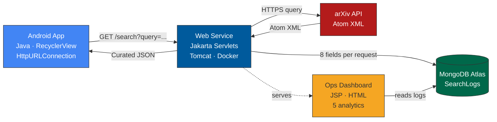

# ScholarSearch

> Search arXiv's 2M+ academic papers from your phone. Get clean results in seconds, not minutes of scrolling through dense feeds.

<p align="center">
  
</p>

<p align="center">
  <a href="https://youtu.be/u3WGUR-A3V4">▶ Watch the demo</a>
</p>

---

## The Problem

arXiv hosts over 2 million research papers and adds ~15,000 monthly. But its interface is desktop-first, search results are cluttered with metadata researchers don't need on the go, and there's no mobile-native experience. For grad students and practitioners scanning for papers between classes or on a commute, the friction adds up.

## What ScholarSearch Does

Type a research keyword. Get back a clean, scrollable list of recent papers — title, authors, date, categories, and a short abstract. Tap any row to jump straight to the PDF. That's it.

Behind the scenes, a cloud-hosted middleware layer handles the heavy lifting: querying arXiv's Atom XML feed, parsing and filtering 30+ metadata fields down to the 7 the mobile app actually renders, logging every request for operational visibility, and serving a live analytics dashboard.

## Architecture



**Why this architecture?** The mobile client stays thin — it issues a single GET and renders. All business logic, third-party API handling, and data transformation live server-side. If arXiv changes their response format tomorrow, the web service adapts; the app ships unchanged.

## Tech Stack

| Layer | What | Why |
|---|---|---|
| Mobile | Android (Java), RecyclerView, HttpURLConnection, org.json | Native performance, no extra dependencies, runs on API 24+ |
| Middleware | Java 16, Jakarta Servlets, Tomcat / TomEE, Maven | Lightweight, container-friendly, no framework overhead |
| Third-party | [arXiv API](https://info.arxiv.org/help/api/index.html) | Free, open-access, no auth required, 2M+ papers |
| Storage | MongoDB Atlas (free tier) | Schema-flexible for log documents, cloud-hosted, zero ops |
| Dashboard | JSP, vanilla HTML/CSS | Spec called for <20 lines of JSP; no framework needed |
| Deployment | Docker, GitHub Codespaces | One-command deploy, self-healing startup scripts |

## Features

**For the user:**
- Keyword search across arXiv's full catalog, sorted by newest first
- Clean result cards: title, authors, date, categories, abstract snippet
- One-tap PDF access — opens in device browser
- Repeatable sessions — search again without restarting

**For the operator:**
- Live dashboard at `/dashboard` with 5 analytics: total requests, average arXiv latency, top search term, success rate, total papers served
- Structured HTML log table (not raw JSON) with timestamp, query, result count, latency, HTTP status, client IP, user agent
- Every request logged — including failures — so you see the real picture, not just the happy path

## Engineering Decisions Worth Mentioning

**Minimal payload design.** arXiv's Atom feed returns ~30 fields per paper. The middleware parses the full response once and forwards only 7 fields to the phone. Typical payload reduction: ~90%. This matters on mobile networks.

**Logging in a `finally` block.** Every request writes to MongoDB regardless of success or failure. Failed calls (arXiv timeout, bad input, server errors) get logged with the same schema as successful ones. The dashboard can show failure rates and latency distributions honestly because the data isn't survivorship-biased.

**Idempotent deployment scripts.** The `build-and-run.sh` script auto-starts the Docker daemon if it's down, removes any stale container before launching a fresh one, and runs on every Codespace boot via `postStartCommand`. Result: spin up a Codespace, wait 90 seconds, the URL works. No manual terminal commands.

**Servlets over JAX-RS.** JAX-RS has known packaging issues when deployed as a WAR inside Tomcat-in-Docker. Pure Jakarta Servlets deploy reliably with zero config and no framework dependencies.

## Running It

### Cloud (recommended)

1. Open this repo in **GitHub Codespaces** (Code → Codespaces → Create codespace on main)
2. Wait ~90 seconds — the server auto-starts
3. In the Ports tab, right-click port 8080 → Visibility → **Public**
4. Visit the forwarded URL:
   - `/` — landing page
   - `/search?query=quantum+computing` — JSON API
   - `/dashboard` — ops dashboard

### Android app

1. Open `Project4Task2Android/` in Android Studio
2. Update `SERVER_BASE_URL` in `MainActivity.java` to your Codespace URL
3. Run on any emulator API 24+ or a physical device
4. Search, scroll, tap a paper to open its PDF

### Your own MongoDB

The project expects a MongoDB Atlas connection string in `MongoLogger.java` and `DashboardServlet.java`. Create a free cluster at [mongodb.com/atlas](https://www.mongodb.com/atlas/database), whitelist `0.0.0.0/0`, substitute your URI. The database and collection are created on first write.

## Project Structure

```
├── src/main/java/ds/project4task2/
│   ├── SearchServlet.java        GET /search — the API endpoint
│   ├── DashboardServlet.java     GET /dashboard — ops dashboard controller
│   ├── ArxivClient.java          arXiv API client + Atom XML parser
│   ├── MongoLogger.java          Writes log documents to Atlas
│   └── Paper.java                Immutable data model
├── src/main/webapp/
│   └── dashboard.jsp             Dashboard view
├── Project4Task2Android/
│   └── app/src/main/java/.../
│       ├── MainActivity.java     Search UI + networking
│       ├── PaperAdapter.java     RecyclerView adapter
│       └── Paper.java            Client-side data model
├── .devcontainer.json            Codespace config with auto-start
├── build-and-run.sh              Idempotent Docker build + run
├── Dockerfile                    Tomcat 10 image
├── pom.xml                       Maven build (finalName: ROOT)
└── ROOT.war                      Pre-built deployable
```

## What I'd Build Next

- **Saved searches + push notifications** — WorkManager job that checks for new papers in saved topics daily and notifies the user
- **Semantic search** — swap arXiv's keyword API for Semantic Scholar or OpenAlex to search by meaning, not just string match
- **API authentication** — add API key validation to `/search` so the endpoint can be offered to third-party consumers
- **Response caching** — a Redis layer in front of the servlet to reduce arXiv load and improve latency for repeated queries
- **Compose UI rewrite** — current XML layouts work but Jetpack Compose would cut ~30% of the Android code

## Acknowledgments

Thank you to [arXiv](https://arxiv.org/) for use of its open access interoperability.

## License

MIT — see [LICENSE](LICENSE) for details.
